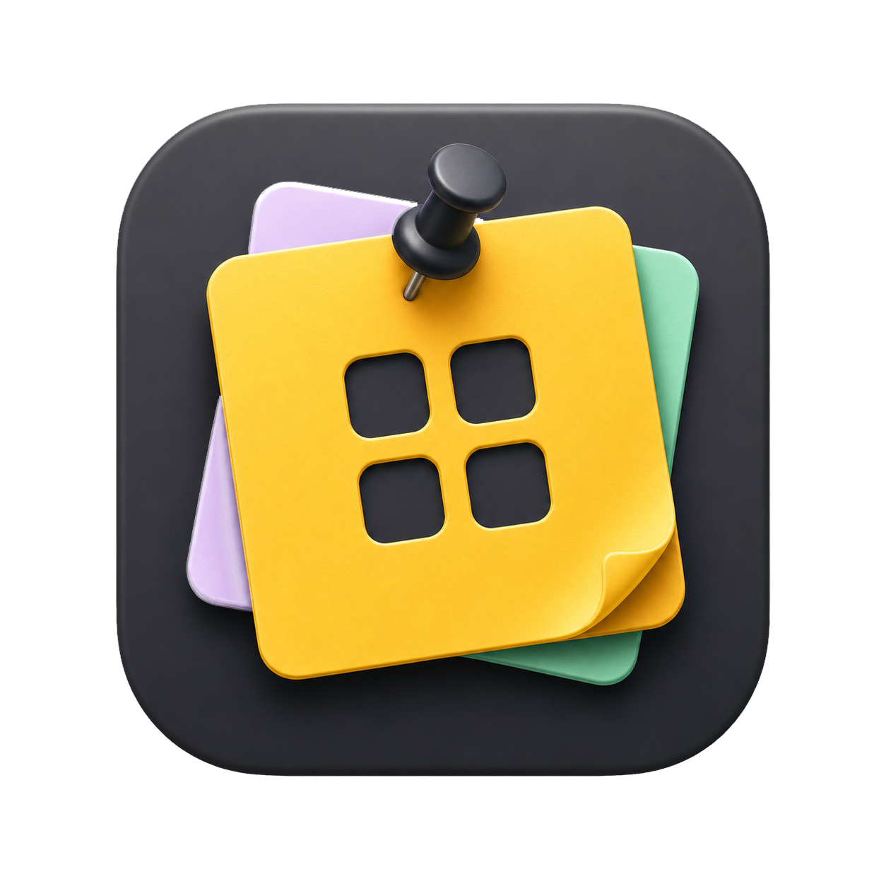

# Keep Widgets for macOS

Native WidgetKit widgets for Google Keep notes. Add as many copies as you need to the desktop and assign a different slot (1–12) to each widget.

## Features

- Native small, medium, and large macOS widgets
- 12 independent note slots
- Manual note editing in the macOS app
- Full selectable note view with one-click description copying
- One-click import from an open Google Keep note in Brave
- Local-only storage with no third-party server

## Usage

1. Launch `Keep Widgets.app` and fill the slots manually, or import notes from Google Keep with the Brave extension.
2. Control-click an empty area of the desktop and choose **Edit Widgets…**.
3. Select **Keep Widgets**, then drag a small, medium, or large widget onto the desktop.
4. Click a widget to open the complete note in Keep Widgets, select its text, copy the description, or open the original in Google Keep.
5. To display a different note, Control-click the widget, choose **Edit “Google Keep Note”…**, and select a slot.
6. Repeat for every note you want to keep visible.

## Import from Google Keep in Brave

The local extension adds an **Add to Desktop** button to `keep.google.com`. It reads only the note you currently have open and sends the selected content directly to the macOS app at `127.0.0.1:43821`. No data is sent to a third-party server.

1. Open `brave://extensions`.
2. Enable **Developer mode**.
3. Click **Load unpacked**.
4. Select the `Brave Extension` folder from this project or from the installed app's Resources folder.
5. Open a note in Google Keep, click **Add to Desktop**, and choose a slot from 1 to 12.

`Keep Widgets.app` must be running while importing. Saved widgets continue to work without Brave or the app being open.

Notes are stored locally in `/Users/Shared/KeepWidgets/notes.json`.

## Build

Open `KeepWidgets.xcodeproj` in Xcode, select your Personal Team, and build the **Keep Widgets** scheme. A valid Apple Development signature is required for the widget extension to appear in the macOS widget gallery.

Requires macOS 14 or later and Xcode 15 or later.
